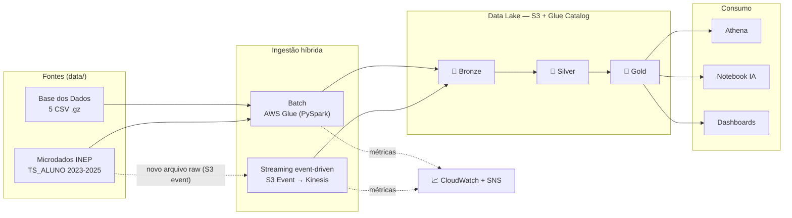

# Tech Challenge – Fase 2
## Pipeline Híbrido para Análise da Alfabetização no Brasil 🇧🇷📊

Projeto integrador da Fase 2 da Pós-Tech, desenvolvido por um time que atua como
equipe de engenharia de dados de uma organização pública de análise educacional.
O objetivo é construir uma **pipeline híbrida de dados (Batch + Streaming)**,
escalável em nuvem, que integre diferentes fontes relacionadas ao **Indicador
Criança Alfabetizada**, garantindo qualidade, escalabilidade e eficiência de custos.

---

## 📌 Contexto do Problema

A alfabetização na infância é um dos pilares para o desenvolvimento educacional,
social e econômico do país. O **Compromisso Nacional Criança Alfabetizada** é uma
política pública que mobiliza União, estados, Distrito Federal e municípios para
garantir que todas as crianças estejam alfabetizadas até o final do **2º ano do
ensino fundamental**.

A partir da **Pesquisa Alfabetiza Brasil (INEP, 2023)** foi definido o ponto de
corte de **743 pontos** na escala de proficiência do Saeb, nível a partir do qual
uma criança pode ser considerada alfabetizada. Com base nesse parâmetro foi criado
o **Indicador Criança Alfabetizada**, que expressa o percentual de estudantes que
atingem esse patamar. A **meta nacional** é que, até **2030**, todas as crianças
brasileiras estejam alfabetizadas ao final do 2º ano.

Compreender os fatores que influenciam a alfabetização exige integrar diferentes
fontes de dados: metas nacionais e estaduais, metas municipais, dados territoriais,
microdados educacionais e indicadores de desempenho.

**Fonte de dados:** Indicador Criança Alfabetizada – [Base dos Dados](https://basedosdados.org/)

---

## 🎯 Objetivo Técnico

Construir uma pipeline de dados escalável em nuvem que realize:

- Ingestão de diferentes fontes de dados educacionais;
- Tratamento e padronização das informações;
- Integração entre bases heterogêneas;
- Disponibilização de uma camada analítica confiável;
- Monitoramento operacional do pipeline;
- Controle de custos da infraestrutura.

---

## 🗂️ Fontes de Dados

A pipeline integra as seguintes entidades, originadas das avaliações de
alfabetização do **INEP**. Os arquivos brutos baixados ficam versionados na pasta
[`data/`](data/) no formato comprimido (`.csv.gz` / `.zip`):

| Entidade | Arquivo em `data/` | Formato |
|----------|--------------------|---------|
| UF | `br_inep_avaliacao_alfabetizacao_uf.csv.gz` | CSV (gzip) |
| Município | `br_inep_avaliacao_alfabetizacao_municipio.csv.gz` | CSV (gzip) |
| Meta Alfabetização Brasil | `br_inep_avaliacao_alfabetizacao_meta_alfabetizacao_brasil.csv.gz` | CSV (gzip) |
| Meta Alfabetização por UF | `br_inep_avaliacao_alfabetizacao_meta_alfabetizacao_uf.csv.gz` | CSV (gzip) |
| Meta Alfabetização por Município | `br_inep_avaliacao_alfabetizacao_meta_alfabetizacao_municipio.csv.gz` | CSV (gzip) |
| Dados de alunos (microdados) | `microdados_avaliacao_da_alfabetizacao_2023.zip`, `microdados_avaliacao_da_alfabetizacao_2024.zip`, `microdados_AEEB_2025.zip` | ZIP |

> Os microdados (`microdados_*.zip`) contêm as tabelas `TS_ALUNO`, `TS_MUNICIPIO`,
> `TS_ESTADO` e `TS_ITEM`, além de dicionários e scripts de leitura (R / SAS / SPSS).

### Fontes externas (opcional – enriquecimento)

| Dimensão | Fonte |
|----------|-------|
| Estrutura escolar | Censo Escolar (INEP) |
| Socioeconômico | IBGE – Censo / PNAD |
| Desenvolvimento humano | Atlas do Desenvolvimento Humano |
| Vulnerabilidade social | Cadastro Único / Bolsa Família |
| Território | IBGE |
| Financiamento | FUNDEB |

---

## 🏗️ Arquitetura da Solução

Arquitetura híbrida (**batch + streaming**) na **AWS**, seguindo a **Arquitetura Medalhão**.
Documentação detalhada, com todos os diagramas, modelo de dados e trade-offs, em
[`projeto/docs/arquitetura.md`](projeto/docs/arquitetura.md).



### Stack AWS

| Função | Serviço |
|--------|---------|
| Data lake (raw/bronze/silver/gold) | Amazon S3 |
| Processamento batch | AWS Glue (PySpark) |
| Catálogo de metadados | AWS Glue Data Catalog |
| Ingestão streaming | Amazon Kinesis Data Streams |
| Consulta analítica | Amazon Athena |
| Orquestração | Step Functions + EventBridge |
| Observabilidade | Amazon CloudWatch + SNS |
| Infra como código | Terraform |

### Ingestão Híbrida

- **Batch** — processamento periódico de dados históricos (metas educacionais,
  municípios, dados agregados nacionais).
- **Streaming (event-driven)** — reage a mudanças nos dados raw: um evento
  `s3:ObjectCreated` dispara a publicação dos novos registros no Kinesis e a atualização
  incremental do indicador.

### Camadas Medalhão

| Camada | Descrição |
|--------|-----------|
| 🥉 **Bronze** | Dados brutos ingeridos das fontes, sem transformações significativas, com histórico completo preservado. |
| 🥈 **Silver** | Dados tratados: limpeza, tratamento de valores ausentes, padronização de nomes e tipos, validação de consistência, normalização de chaves e **integração das bases**. |
| 🥇 **Gold** | Camada analítica: datasets prontos para análise (indicador por município, comparação metas × resultados, evolução temporal), preparados para dashboards, análises estatísticas e treinamento de modelos de ML. |

---

## Regras de Qualidade de Dados

A qualidade de dados é implementada como um "gate" (portão) entre a camada Bronze e a
Silver. O job le a Bronze, executa um catalogo de validacoes e decide se os dados podem
seguir para a Silver. Se algum check critico falhar, a pipeline para e um alerta e
disparado; caso contrario, um relatorio de qualidade e gerado e a Silver e liberada.

Codigo em [`projeto/quality/`](projeto/quality/): `checks.py` (checks reutilizaveis),
`rules.py` (catalogo por tabela), `report.py` (relatorio) e `run_quality.py` (o gate).

### Categorias de validacao

Duplicidade. Chaves de negocio nao podem se repetir. Exemplos: `municipio` unica por
(ano, id_municipio, serie, rede); `ts_aluno` com `ID_ALUNO` unico por ano; `ts_municipio`
unica por (ano, CO_MUNICIPIO, TP_SERIE, ID_TIPO_REDE).

Valores ausentes. Chaves de identidade nunca nulas (bloqueia); percentual de nulos em
metricas acima do limite gera aviso. A ausencia de proficiencia so e medida entre alunos
presentes (IN_PRESENCA_LP = 1), pois alunos ausentes legitimamente nao tem nota.

Integridade referencial. Codigos de municipio com 7 digitos; todo aluno pertence a um
municipio presente no agregado oficial; metas por municipio referem-se a municipios
conhecidos.

Consistencia entre tabelas. Comparacao cross-source da taxa de alfabetizacao entre a Base
dos Dados (`taxa_alfabetizacao`) e o INEP (`PC_ALUNO_ALFABETIZADO`) no mesmo grao, com
tolerancia em pontos percentuais. Ha ainda um check que liga a regra de negocio: a flag
oficial `IN_ALFABETIZADO` deve ser coerente com o corte de 743 pontos
(`VL_PROFICIENCIA_LP >= 743`).

### Severidade e efeito no gate

ERROR bloqueia a pipeline e dispara alerta (ex.: chave de identidade nula, chave primaria
duplicada, divergencia grave entre `IN_ALFABETIZADO` e o corte 743).
WARN apenas registra no relatorio e nao bloqueia (ex.: percentual alto de nulo em metrica,
divergencia cross-source dentro da tolerancia, codigo de municipio ausente).

Exemplo real observado: nos microdados de 2025 ha 628 alunos com `CO_MUNICIPIO` em branco,
vinculados a dez escolas nao localizadas no Censo Escolar 2025 (RO, PE, ES, SP, MT). Como
os registros tem identidade e proficiencia validas e podem ser retificados em versoes
futuras, o caso e tratado como WARN (alerta), sem bloquear a pipeline.

### Saidas

Relatorio em JSON e Markdown por execucao (`lake/quality/report/<run_id>.json|.md` no
local; prefixo `quality/report/` no S3), alem de metricas para o CloudWatch
(`dq_error_count`, `dq_warn_count`, `dq_checks_total`) que alimentam o monitoramento.

### Como executar (local)

A partir de `projeto/`, com a Bronze ja gerada:

```bash
python quality/run_quality.py
```

O resultado do gate pode ser PASS, PASS_WITH_WARNINGS ou FAIL. Em caso de FAIL, o processo
retorna erro e interrompe a pipeline.

Os limites (tolerancias) sao configuraveis em
[`projeto/config/settings.yaml`](projeto/config/settings.yaml) na secao `quality`.

---

## 📈 Monitoramento da Pipeline

Mecanismos de observabilidade esperados:

- Falhas de ingestão;
- Latência do pipeline;
- Volume de dados processados;
- Alertas de erro.

---

## 💰 FinOps – Otimização de Custos

Boas práticas de eficiência no uso da nuvem:

- Uso eficiente de armazenamento (**Parquet**, particionamento);
- Otimização de queries;
- Controle de recursos computacionais;
- Estimativa de custo da arquitetura.

---

## ☁️ Implementação em Cloud

A solução será implementada em ambiente de nuvem (**AWS / GCP / Azure**).

---

## 🤖 Aplicação em IA

A camada Gold poderá ser usada para:

- Modelos de predição de alfabetização por município;
- Análise de desigualdade educacional / clusters de vulnerabilidade;
- Subsídio a políticas públicas baseadas em dados.

---

## 📁 Estrutura do Repositório

```
TechChallenge_2/
├── data/              # Dados brutos baixados das fontes (comprimidos: .csv.gz / .zip)
├── projeto/           # Código e artefatos da pipeline
│   ├── common/        # Config, SparkSession, logging, I/O (local/S3)
│   ├── config/        # settings.yaml + .env.example
│   ├── bronze/        # Ingestão de dados brutos
│   ├── silver/        # Tratamento, padronização e integração
│   ├── gold/          # Camada analítica (+ notebook de IA)
│   ├── quality/       # Scripts de validação e qualidade de dados
│   ├── streaming/     # Producer/consumer Kinesis
│   ├── orchestration/ # Orquestração da pipeline
│   ├── infra/         # Terraform (S3, Glue, Kinesis, CloudWatch)
│   └── docs/          # Documentação técnica e diagramas
└── README.md          # Documentação da solução
```

> A separação entre [`data/`](data/) (dados de entrada) e [`projeto/`](projeto/)
> (código da pipeline) mantém os dados baixados isolados da lógica de processamento.

---

## 🚀 Tecnologias

Stack principal na **AWS**: **S3** (data lake), **AWS Glue / PySpark** (processamento),
**Glue Data Catalog + Athena** (catálogo e consulta), **Kinesis Data Streams** (streaming),
**CloudWatch + SNS** (observabilidade) e **Terraform** (infra como código).

As justificativas de cada escolha estão detalhadas em
[`projeto/docs/arquitetura.md`](projeto/docs/arquitetura.md#7-tecnologias-e-justificativas).

---

## 👥 Equipe

| Integrante | Contato |
|------------|---------|
| Isabelle Nicole Santana de Brito | isabelle_nicole@outlook.com |
| Filipe Noberto Justino | justinofilipe03@hotmail.com |
| Leandro Rebes Camargo | leandrorcamargo@hotmail.com |
| Felipe Vieira Sanches | fvieirasanches@gmail.com |

---

## 📹 Vídeo Executivo

> _Link a ser adicionado (apresentação executiva de até 5 minutos)._
