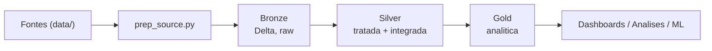

# Tech Challenge – Fase 2
## Pipeline Híbrido para Análise da Alfabetização no Brasil 🇧🇷📊

Projeto integrador da Fase 2 da Pós-Tech, desenvolvido por um time que atua como
equipe de engenharia de dados de uma organização pública de análise educacional.
O objetivo é construir uma **pipeline híbrida de dados (Batch + Streaming)**,
escalável em nuvem, que integre diferentes fontes relacionadas ao **Indicador
Criança Alfabetizada**, garantindo qualidade, escalabilidade e eficiência de custos.

---

## 📌 Contexto do Problema

A alfabetização na infância é um dos pilares para o desenvolvimento educacional,
social e econômico do país. O **Compromisso Nacional Criança Alfabetizada** é uma
política pública que mobiliza União, estados, Distrito Federal e municípios para
garantir que todas as crianças estejam alfabetizadas até o final do **2º ano do
ensino fundamental**.

A partir da **Pesquisa Alfabetiza Brasil (INEP, 2023)** foi definido o ponto de
corte de **743 pontos** na escala de proficiência do Saeb, nível a partir do qual
uma criança pode ser considerada alfabetizada. Com base nesse parâmetro foi criado
o **Indicador Criança Alfabetizada**, que expressa o percentual de estudantes que
atingem esse patamar. A **meta nacional** é que, até **2030**, todas as crianças
brasileiras estejam alfabetizadas ao final do 2º ano.

Compreender os fatores que influenciam a alfabetização exige integrar diferentes
fontes de dados: metas nacionais e estaduais, metas municipais, dados territoriais,
microdados educacionais e indicadores de desempenho.

**Fonte de dados:** Indicador Criança Alfabetizada – [Base dos Dados](https://basedosdados.org/)

---

## 🎯 Objetivo Técnico

Construir uma pipeline de dados escalável em nuvem que realize:

- Ingestão de diferentes fontes de dados educacionais;
- Tratamento e padronização das informações;
- Integração entre bases heterogêneas;
- Disponibilização de uma camada analítica confiável;
- Monitoramento operacional do pipeline;
- Controle de custos da infraestrutura.

---

## 🗂️ Fontes de Dados

A pipeline integra as seguintes entidades, originadas das avaliações de
alfabetização do **INEP**. Os arquivos brutos baixados ficam versionados na pasta
[`data/`](data/) no formato comprimido (`.csv.gz` / `.zip`):

| Entidade | Arquivo em `data/` | Formato |
|----------|--------------------|---------|
| UF | `br_inep_avaliacao_alfabetizacao_uf.csv.gz` | CSV (gzip) |
| Município | `br_inep_avaliacao_alfabetizacao_municipio.csv.gz` | CSV (gzip) |
| Meta Alfabetização Brasil | `br_inep_avaliacao_alfabetizacao_meta_alfabetizacao_brasil.csv.gz` | CSV (gzip) |
| Meta Alfabetização por UF | `br_inep_avaliacao_alfabetizacao_meta_alfabetizacao_uf.csv.gz` | CSV (gzip) |
| Meta Alfabetização por Município | `br_inep_avaliacao_alfabetizacao_meta_alfabetizacao_municipio.csv.gz` | CSV (gzip) |
| Dados de alunos (microdados) | `microdados_avaliacao_da_alfabetizacao_2023.zip`, `microdados_avaliacao_da_alfabetizacao_2024.zip`, `microdados_AEEB_2025.zip` | ZIP |

> Os microdados (`microdados_*.zip`) contêm as tabelas `TS_ALUNO`, `TS_MUNICIPIO`,
> `TS_ESTADO` e `TS_ITEM`, além de dicionários e scripts de leitura (R / SAS / SPSS).

### Fontes externas (opcional – enriquecimento)

| Dimensão | Fonte |
|----------|-------|
| Estrutura escolar | Censo Escolar (INEP) |
| Socioeconômico | IBGE – Censo / PNAD |
| Desenvolvimento humano | Atlas do Desenvolvimento Humano |
| Vulnerabilidade social | Cadastro Único / Bolsa Família |
| Território | IBGE |
| Financiamento | FUNDEB |

---

## 🏗️ Arquitetura da Solução

Arquitetura em **Databricks** (Unity Catalog + Delta Lake), seguindo a **Arquitetura Medalhão**.
Documentação detalhada, com diagramas e mapeamento de tabelas, em
[`projeto/docs/arquitetura.md`](projeto/docs/arquitetura.md).



### Ingestão

- **Batch** (implementado) — três notebooks PySpark executados em ordem: bronze, silver, gold.
- **Streaming** (nativo do Databricks) — descrito como guia na
  [documentação de arquitetura](projeto/docs/arquitetura.md#6-ingestao-streaming-databricks):
  novos arquivos chegando a uma pasta de landing são processados de forma incremental via
  **Auto Loader** ou **file arrival trigger** (Databricks Workflows), acionados pela chegada
  real de arquivos.

### Camadas Medalhão

| Camada | Descrição |
|--------|-----------|
| Bronze | Cópia fiel das fontes, tudo como string; apenas normalização de nomes de coluna. |
| Silver | Tipos corrigidos, `rede` padronizada, tratamento de duplicidades e nulos, validação de consistência (inclui cross-source) e **integração das bases**. |
| Gold | Sete datasets analíticos: indicadores por município, metas × resultados (município e UF), evolução temporal, agregações por UF, métricas Brasil e features para ML. |

---

## ✅ Regras de Qualidade de Dados

- Verificação de duplicidade;
- Detecção de valores ausentes;
- Validação de chaves de relacionamento;
- Consistência entre tabelas.

---

## 📈 Monitoramento da Pipeline

Mecanismos de observabilidade esperados:

- Falhas de ingestão;
- Latência do pipeline;
- Volume de dados processados;
- Alertas de erro.

---

## 💰 FinOps – Otimização de Custos

Boas práticas de eficiência no uso da nuvem:

- Uso eficiente de armazenamento (**Parquet**, particionamento);
- Otimização de queries;
- Controle de recursos computacionais;
- Estimativa de custo da arquitetura.

---

## ☁️ Implementação em Cloud

A solução é implementada no **Databricks** (plataforma de dados em nuvem), usando
**Unity Catalog** para organização/governança das tabelas e **Delta Lake** como formato
de armazenamento das camadas bronze, silver e gold.

---

## 🤖 Aplicação em IA

A camada Gold poderá ser usada para:

- Modelos de predição de alfabetização por município;
- Análise de desigualdade educacional / clusters de vulnerabilidade;
- Subsídio a políticas públicas baseadas em dados.

---

## 📁 Estrutura do Repositório

```
TechChallenge_2/
├── data/              # Dados brutos das fontes (comprimidos: .csv.gz / .zip) — versionados
├── projeto/           # Código e artefatos da pipeline
│   ├── bronze/        # prep_source.py + 01_bronze_ingestao.ipynb
│   ├── silver/        # 02_silver_limpeza_validacao.ipynb
│   ├── gold/          # 03_gold_datasets_analiticos.ipynb
│   └── docs/          # Documentação técnica e diagramas (arquitetura.md)
└── README.md          # Documentação da solução
```

> Fluxo de execução: `prep_source.py` prepara os arquivos em uma pasta `source/` (não
> versionada), que é enviada ao workspace do Databricks; então os notebooks bronze, silver e
> gold são executados em ordem. Dados derivados/intermediários (`source/`, `lake/`) ficam fora
> do Git — apenas as fontes originais em [`data/`](data/) são versionadas.

---

## 🚀 Tecnologias

- **Databricks** — ambiente gerenciado de Spark com notebooks e computação sob demanda.
- **Delta Lake** — formato transacional (ACID) sobre Parquet para as tabelas do medalhão.
- **Unity Catalog** — organização das tabelas por schema (`bronze`/`silver`/`gold`).
- **PySpark** — processamento distribuído (lida com os microdados de aluno, milhões de linhas).
- **Parquet + particionamento por ano** — leitura colunar e redução de custo de scan (FinOps).

As justificativas de cada escolha estão em
[`projeto/docs/arquitetura.md`](projeto/docs/arquitetura.md#7-tecnologias-e-justificativas).

---

## 👥 Equipe

| Integrante | Contato |
|------------|---------|
| Isabelle Nicole Santana de Brito | isabelle_nicole@outlook.com |
| Filipe Noberto Justino | justinofilipe03@hotmail.com |
| Leandro Rebes Camargo | leandrorcamargo@hotmail.com |
| Felipe Vieira Sanches | fvieirasanches@gmail.com |

---

## 📹 Vídeo Executivo

> _Link a ser adicionado (apresentação executiva de até 5 minutos)._
