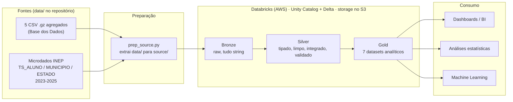
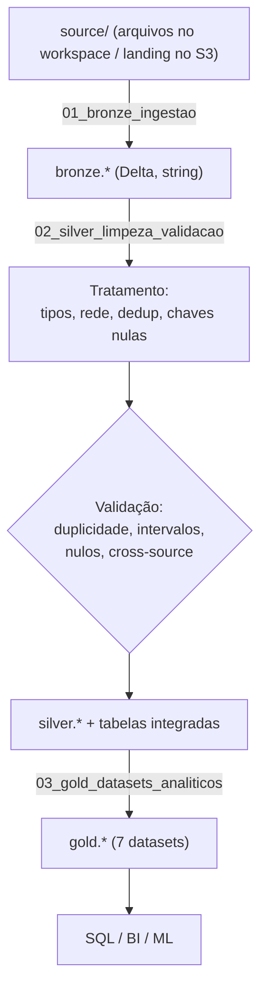
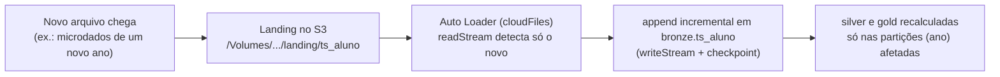

# Tech Challenge – Fase 2

## Pipeline Híbrido para Análise da Alfabetização no Brasil

Projeto integrador da Fase 2 da Pós-Tech. O grupo assume o papel de uma equipe de engenharia de dados de uma organização pública de análise educacional e monta uma pipeline híbrida (batch + streaming) para integrar as fontes ligadas ao Indicador Criança Alfabetizada, com atenção a qualidade, escalabilidade e custo.

A implementação roda no Databricks sobre a AWS: o data lake fica no Amazon S3, as tabelas são gravadas em Delta Lake e a organização/governança é feita pelo Unity Catalog. As camadas seguem a arquitetura medalhão (bronze, silver e gold).

## Links do projeto

- **Repositório:** https://github.com/leandrorcamargo/TechChallenge_2-
- **Data lake (S3):** https://us-east-2.console.aws.amazon.com/s3/buckets/amzn-s3-fiap-tech2?region=us-east-2&tab=objects
- **Workspace Databricks:** https://dbc-082a3d64-ec06.cloud.databricks.com
- **Vídeo executivo (até 5 min):** https://drive.google.com/file/d/1AId5YoI50XOTlVGVHedo2clFWsKWcldw/view
- **Apresentação (slides):** https://docs.google.com/presentation/d/1P_KsUP0KAQ93QWClQs_smGl0ya4aArsg/edit

> Os links do S3 e do Databricks apontam para ambientes autenticados e dependem das credenciais do time.

## Contexto

A alfabetização nos primeiros anos escolares é base para o desenvolvimento educacional e social do país. O Compromisso Nacional Criança Alfabetizada é a política pública que reúne União, estados, DF e municípios com a meta de que toda criança esteja alfabetizada até o fim do 2º ano do ensino fundamental.

A partir da Pesquisa Alfabetiza Brasil (INEP, 2023), o Saeb passou a usar 743 pontos como ponto de corte: acima disso, a criança é considerada alfabetizada. Esse parâmetro deu origem ao Indicador Criança Alfabetizada, que mede o percentual de estudantes que alcança esse patamar. A meta nacional é chegar a 2030 com todas as crianças alfabetizadas ao final do 2º ano.

Só olhar o indicador isolado não explica muita coisa. Para entender o que influencia a alfabetização é preciso cruzar fontes diferentes — metas nacionais, estaduais e municipais, dados territoriais, microdados e indicadores de desempenho. É esse cruzamento que permite medir a distância de cada município em relação à meta de 2030, comparar realidades regionais e dar base a decisões de política pública.

O trabalho da pipeline é justamente esse: pegar dados públicos brutos e espalhados e entregar uma camada analítica confiável, pronta para dashboards, análises estatísticas e modelos de machine learning.

**Fonte principal:** Indicador Criança Alfabetizada, da Base dos Dados, além dos microdados oficiais do INEP.

## Objetivo técnico

Construir uma pipeline em nuvem que faça a ingestão de fontes educacionais diferentes, trate e padronize as informações, integre as bases, disponibilize uma camada analítica confiável e permita monitorar a operação e controlar os custos da infraestrutura.

## Fontes de dados

Os arquivos brutos ficam versionados na pasta `data/`, comprimidos em `.csv.gz` ou `.zip`:

| Entidade | Arquivo em `data/` | Formato | Origem |
|---|---|---|---|
| UF | `br_inep_avaliacao_alfabetizacao_uf.csv.gz` | CSV (gzip) | Base dos Dados |
| Município | `br_inep_avaliacao_alfabetizacao_municipio.csv.gz` | CSV (gzip) | Base dos Dados |
| Meta Alfabetização Brasil | `br_inep_avaliacao_alfabetizacao_meta_alfabetizacao_brasil.csv.gz` | CSV (gzip) | Base dos Dados |
| Meta Alfabetização por UF | `br_inep_avaliacao_alfabetizacao_meta_alfabetizacao_uf.csv.gz` | CSV (gzip) | Base dos Dados |
| Meta Alfabetização por Município | `br_inep_avaliacao_alfabetizacao_meta_alfabetizacao_municipio.csv.gz` | CSV (gzip) | Base dos Dados |
| Dados de alunos (microdados) | `microdados_avaliacao_da_alfabetizacao_2023.zip`, `..._2024.zip`, `microdados_AEEB_2025.zip` | ZIP | INEP |

Os microdados trazem as tabelas `TS_ALUNO`, `TS_MUNICIPIO`, `TS_ESTADO` e `TS_ITEM`, com dicionários e scripts de leitura em R, SAS e SPSS. Eles são a fonte canônica do projeto; os agregados da Base dos Dados entram também como referência para validação cruzada.

Como enriquecimento opcional (para modelos preditivos ou clusters de vulnerabilidade), dá para trazer contexto de fora: estrutura escolar pelo Censo Escolar (INEP), socioeconômico pelo IBGE (Censo/PNAD), desenvolvimento humano pelo Atlas, vulnerabilidade pelo Cadastro Único/Bolsa Família, território pelo IBGE e financiamento pelo FUNDEB.

## Arquitetura

A pipeline roda no Databricks (AWS), com storage no S3, tabelas em Delta Lake, catálogo no Unity Catalog e orquestração pelos Databricks Workflows, seguindo o medalhão.



## Fluxo de dados (batch)

O caminho principal é batch: `prep_source.py` descompacta o `data/` e organiza tudo em `source/`, que é enviado ao workspace (ou à pasta de landing no S3). A partir daí, três notebooks PySpark rodam em ordem — bronze, silver e gold.



**Ordem de execução:**

1. `projeto/bronze/prep_source.py`
2. `projeto/bronze/01_bronze_ingestao.ipynb`
3. `projeto/silver/02_silver_limpeza_validacao.ipynb`
4. `projeto/gold/03_gold_datasets_analiticos.ipynb`

## Ingestão híbrida

O batch é o que está implementado e faz a carga histórica (metas, municípios e agregados nacionais).

O streaming usa o que o Databricks já oferece de forma nativa, reagindo à chegada real de arquivos — sem gerar dados sintéticos. Quando um arquivo novo cai na pasta de landing (por exemplo, os microdados de um novo ano), o Auto Loader (`cloudFiles`) detecta só o que chegou e faz append incremental na bronze; silver e gold são recalculadas apenas nas partições de ano afetadas.



Como alternativa sem código, dá para configurar um Job com gatilho *file arrival* nos Workflows: a chegada de um arquivo dispara a sequência bronze → silver → gold automaticamente.

## Camadas do medalhão

A **bronze** é a cópia fiel das fontes — tudo como string, só com os nomes de coluna normalizados, preservando o histórico completo. São oito tabelas: `indicador_alfabetizacao_uf`, `indicador_alfabetizacao_municipio`, `meta_alfabetizacao_brasil`, `meta_alfabetizacao_uf`, `meta_alfabetizacao_municipio`, `ts_aluno`, `ts_municipio` e `ts_estado`.

A **silver** corrige os tipos, padroniza a coluna `rede`, limpa textos, trata duplicidades e chaves nulas, valida a consistência (incluindo comparações entre fontes) e, principalmente, integra as bases. Além das oito tabelas tratadas, gera `indicador_municipio_integrado`, `indicador_uf_integrado`, `tratamento_silver` e `validacao_silver`.

A **gold** entrega sete datasets prontos para consumo: `indicadores_municipio`, `metas_vs_resultados_municipio`, `metas_vs_resultados_uf`, `evolucao_temporal_municipio`, `agregacoes_uf`, `metricas_brasil` e `features_ml`.

A integração acontece na silver, juntando três fontes na mesma granularidade. A `indicador_municipio_integrado` combina taxa e média por município (Base dos Dados), as metas de 2024 a 2030 (Base dos Dados) e a distribuição por nível (`nivel_0..8`) vinda do `ts_municipio` (microdados do INEP), derivando `codigo_uf` e `gap_meta_2030`. A `indicador_uf_integrado` faz o mesmo por UF, com os níveis do `ts_estado`. Essas duas tabelas alimentam a gold direto, o que deixa os datasets analíticos e as features de ML bem mais simples.

## Qualidade de dados

O controle de qualidade fica na silver e mistura tratamento ativo com verificação; os resultados ficam registrados em `tratamento_silver` e `validacao_silver`.

Duplicatas são removidas com `dropDuplicates` sobre as chaves de negócio. Para valores ausentes, linhas com chave de identidade nula saem, mas nulos de métrica ficam (são informativos) e alunos sem município — casos de escolas fora do Censo Escolar 2025 — são mantidos, porque têm identidade válida. Taxas e percentuais são checados no intervalo `[0, 100]` e a proficiência dentro de uma faixa plausível. A consistência entre tabelas é testada comparando a taxa da Base dos Dados com o percentual oficial do INEP na mesma chave — na validação local, a diferença média deu zero.

## Monitoramento

A observabilidade se apoia no que o Databricks já oferece: logs de Jobs, métricas de cluster e histórico do Delta. Falhas de ingestão aparecem no status de cada tarefa dos Workflows, com retry e notificação por e-mail. A latência é acompanhada pela duração de cada notebook no histórico do Job. O volume processado sai das tabelas de controle (`tratamento_silver`, `validacao_silver`) e das métricas de escrita do Delta. E os alertas de erro combinam os alertas de Job (falha ou SLA estourado) com as próprias tabelas de validação, que sinalizam registros fora do esperado.

## FinOps

Na análise de FinOps, validamos os custos utilizando as System Tables de Billing do Databricks (system.billing.usage), que registram o consumo real de recursos do ambiente.

Os dados mostraram um custo atual de aproximadamente US$ 5,50 por mês, refletindo a fase de desenvolvimento do projeto, em que o ambiente foi utilizado de forma pontual e sem execução recorrente.
Para estimar o cenário de produção, utilizamos o consumo real de DBUs, os preços oficiais do Databricks e uma operação mensal contínua do pipeline Bronze, Silver e Gold. Com isso, projetamos um custo operacional de aproximadamente US$ 13 por mês (US$ 160 por ano), valor que representa o ambiente em funcionamento regular.
Também identificamos um crescimento médio de 17,9% ao ano. Mantida essa tendência, o custo anual pode chegar a aproximadamente US$ 429 em 2030.

## Decisões arquiteturais

Batch foi a escolha para a espinha dorsal, porque a carga histórica é naturalmente batch, com o streaming incremental cobrindo as atualizações near-real-time sem manter cluster ligado o tempo todo. Optamos por lakehouse (Delta no S3) em vez de um data warehouse dedicado por causa do custo sob demanda e da flexibilidade de usar SQL e ML na mesma camada, sem infra fixa. No trade-off de custo contra performance, Parquet colunar, particionamento por ano e clusters efêmeros dão bom desempenho de leitura com gasto mínimo. E antecipar a integração para a silver mantém a gold focada em análise, evitando joins caros repetidos nas queries finais.

## Aplicação em IA

A camada gold, em especial a `features_ml`, já foi pensada para servir modelos. Dá para prever se um município vai atingir a meta de 2030 usando taxa, distribuição por nível, metas e `gap_meta_2030` como features, priorizando ação onde o risco é maior. Para análise de desigualdade, é possível agrupar municípios por vulnerabilidade combinando o indicador com fontes externas (IBGE, FUNDEB, Cadastro Único). E, para política pública, a evolução temporal e a comparação entre meta e resultado servem de base para alocar recursos e acompanhar programas.

## Estrutura do repositório

```
TechChallenge_2/
├── data/                  # Dados brutos das fontes (.csv.gz / .zip) — versionados
├── projeto/               # Código e artefatos da pipeline
│   ├── bronze/            # prep_source.py + 01_bronze_ingestao.ipynb
│   ├── silver/            # 02_silver_limpeza_validacao.ipynb
│   ├── gold/              # 03_gold_datasets_analiticos.ipynb
│   └── docs/              # Documentação técnica e diagramas (arquitetura.md)
├── scripts/               # Scripts auxiliares
├── JOB_PIPELINE.md        # Configuração do Job / orquestração no Databricks
├── WORKFLOW.md            # Fluxo de trabalho do time (Git, branches, PRs)
└── README.md
```

O `prep_source.py` prepara os arquivos numa pasta `source/` (fora do Git), que vai para o workspace ou landing; depois os notebooks rodam em ordem. Dados derivados (`source/`, `lake/`) não são versionados — só as fontes originais em `data/`.

## Tecnologias

Databricks na AWS pelo ambiente gerenciado de Spark, com notebooks, catálogo e computação sob demanda. Amazon S3 como data lake escalável e barato. Delta Lake pelo suporte transacional (ACID) sobre Parquet, com versionamento e desempenho. Unity Catalog para organizar as tabelas por schema (bronze/silver/gold) e cuidar do acesso. PySpark para dar conta dos microdados de aluno, que têm milhões de linhas. Parquet com particionamento por ano pela leitura colunar e economia no scan. E os Databricks Workflows para orquestrar os notebooks e os gatilhos, incluindo o *file arrival trigger*.

## Git

O desenvolvimento segue commits descritivos, branches por funcionalidade e integração via Pull Requests na branch principal. O fluxo do time está em [WORKFLOW.md](WORKFLOW.md).

## Equipe

| Integrante | Contato |
|---|---|
| Isabelle Nicole Santana de Brito | isabelle_nicole@outlook.com |
| Filipe Noberto Justino | justinofilipe03@hotmail.com |
| Leandro Rebes Camargo | leandrorcamargo@hotmail.com |
| Felipe Vieira Sanches | fvieirasanches@gmail.com |

## Vídeo executivo

Apresentação de até 5 minutos: https://drive.google.com/file/d/1AId5YoI50XOTlVGVHedo2clFWsKWcldw/view
