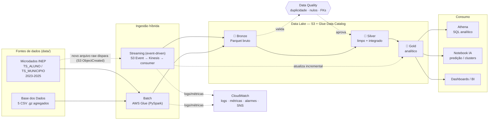
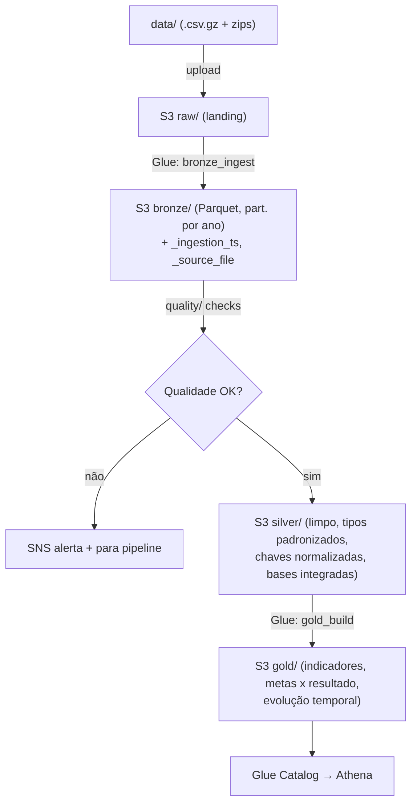
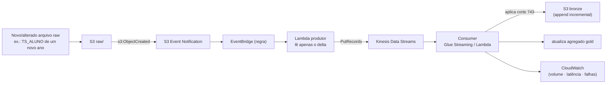
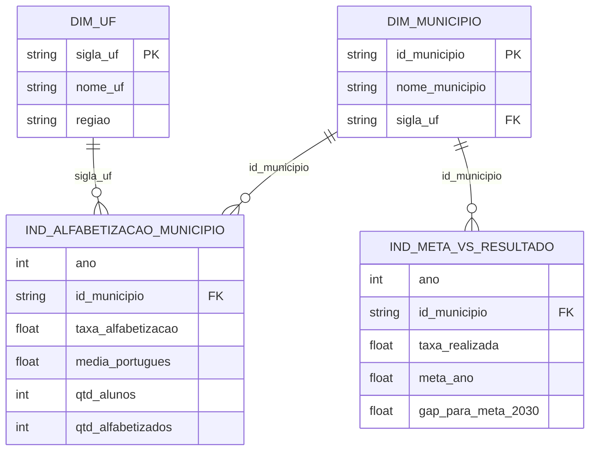

# Arquitetura da Solução

Pipeline híbrida (batch + streaming) para análise do **Indicador Criança Alfabetizada**,
implementada na **AWS** seguindo a **Arquitetura Medalhão** (bronze → silver → gold).

Índice:
1. [Visão geral](#1-visão-geral)
2. [Componentes AWS](#2-componentes-aws)
3. [Fluxo de dados batch](#3-fluxo-de-dados-batch)
4. [Fluxo de dados streaming](#4-fluxo-de-dados-streaming)
5. [Mapeamento medalhão](#5-mapeamento-medalhão)
6. [Modelo de dados da Gold](#6-modelo-de-dados-da-gold)
7. [Tecnologias e justificativas](#7-tecnologias-e-justificativas)
8. [Decisões arquiteturais (trade-offs)](#8-decisões-arquiteturais-trade-offs)
9. [Observabilidade e FinOps](#9-observabilidade-e-finops)

---

## 1. Visão geral

A solução ingere dados por **dois caminhos** que convergem para o mesmo data lake:
- **Batch** — carga periódica dos dados históricos (agregados + microdados).
- **Streaming (event-driven)**: o fluxo é disparado por uma
  mudança nos dados raw no S3 (`s3:ObjectCreated`). Quando um novo/alterado
  arquivo chega, o evento aciona a publicação dos novos registros no Kinesis e o
  indicador é atualizado de forma incremental, como ocorre em produção.

---

## 2. Componentes AWS

| Camada funcional | Serviço AWS | Papel na solução |
|------------------|-------------|------------------|
| Landing / Data Lake | **Amazon S3** | Armazena as 4 zonas (`raw`, `bronze`, `silver`, `gold`) em Parquet. |
| Processamento batch | **AWS Glue (PySpark)** | Jobs de ingestão e transformação bronze→silver→gold. |
| Catálogo de metadados | **AWS Glue Data Catalog** | Registra tabelas/partições para consulta via Athena. |
| Gatilho de mudança real | **S3 Event Notifications + EventBridge** | Detecta criação/alteração real de arquivos no `raw/` e dispara o fluxo streaming. |
| Produtor de eventos | **AWS Lambda** | Lê o delta do arquivo recém-chegado e publica os registros no Kinesis (`PutRecords`). |
| Ingestão streaming | **Amazon Kinesis Data Streams** | Transporta em stream os registros reais das novas medições. |
| Consumo streaming | **Glue Streaming / AWS Lambda** | Aplica corte 743 e atualiza bronze/gold de forma incremental. |
| Consulta analítica | **Amazon Athena** | SQL serverless sobre a camada Gold. |
| Orquestração | **Step Functions + EventBridge** | Encadeia e agenda os jobs batch. |
| Observabilidade | **Amazon CloudWatch + SNS** | Logs, métricas, alarmes e alertas. |
| Infra como código | **Terraform** | Provisão reprodutível e versionada de tudo acima. |

> Os mesmos scripts PySpark rodam **localmente** (`APP_ENV=local`, escrevendo em `lake/`)
> para desenvolvimento sem custo, e **no Glue** (`APP_ENV=aws`) em produção — ver
> [`common/spark.py`](../common/spark.py) e [`common/io.py`](../common/io.py).

---

## 3. Fluxo de dados batch

Etapas:
1. **Landing (`raw`)** — os arquivos de `data/` são copiados para `s3://.../raw/` sem alteração.
2. **Bronze** — leitura com PySpark e gravação em Parquet particionado por `ano`, preservando o
   schema bruto e adicionando metadados técnicos de ingestão. Histórico completo preservado.
3. **Data Quality (gate)** — validações entre bronze e silver; falha dispara alerta e interrompe.
4. **Silver** — limpeza, tratamento de nulos, padronização de tipos, normalização de chaves
   (`ano`, `sigla_uf`, `id_municipio`, `rede`, `serie`) e **integração das bases**.
5. **Gold** — datasets analíticos, registrados no Glue Catalog para consulta via Athena.

---

## 4. Fluxo de dados streaming (event-driven)

O streaming é reativo a mudanças reais no data lake:
sempre que um arquivo de dados raw é criado ou alterado no S3 (ex.: os microdados de um novo
ano são publicados), o S3 emite um evento que dispara todo o fluxo — exatamente como aconteceria
em produção quando uma nova fonte é disponibilizada.

Características:
- **Gatilho real:** o fluxo só executa quando os dados raw mudam (`s3:ObjectCreated`) 
- **Delta apenas:** a Lambda produtora lê somente o arquivo/objeto que chegou e publica seus
  registros no Kinesis.
- **Consumo incremental:** o consumer aplica a regra de negócio e atualiza
  bronze e o agregado gold sem reprocessar o histórico, apenas os dados atualizados ou novos.
- **Ingestão híbrida:** o mesmo indicador é alimentado pelo batch (histórico) e pelo streaming
  (incremental, reativo), convergindo na camada gold.

> Em desenvolvimento local, o mesmo comportamento é validado emulando o evento do S3 via
> **LocalStack** (S3 + Kinesis), copiando um arquivo para o `raw/` e observando o disparo —
> sem qualquer geração artificial de dados.

---

## 5. Mapeamento medalhão

| Camada | Entrada | Transformações | Saída (datasets) |
|--------|---------|----------------|------------------|
| 🥉 **Bronze** | `raw/` (CSV) | Conversão para Parquet, partição por `ano`, metadados de ingestão. Sem regra de negócio. | `uf`, `municipio`, `meta_brasil`, `meta_uf`, `meta_municipio`, `ts_aluno`, `ts_municipio`, `ts_estado`, `ts_item` |
| 🥈 **Silver** | `bronze/` | Limpeza, nulos, tipos, normalização de chaves, dedup, **integração**; corte 743 aplicado aos alunos. | `dim_uf`, `dim_municipio`, `fato_alfabetizacao_municipio`, `fato_alfabetizacao_uf`, `fato_meta_*`, `fato_aluno` |
| 🥇 **Gold** | `silver/` | Agregações e joins analíticos. | `ind_alfabetizacao_municipio`, `ind_meta_vs_resultado`, `ind_evolucao_temporal` |

Detalhes de nomenclatura e particionamento em [`convencoes.md`](convencoes.md).

---

## 6. Modelo de dados da Gold

Modelo dimensional (estrela) simplificado, otimizado para consultas analíticas e ML:

---

## 7. Tecnologias e justificativas

| Tecnologia | Por que foi escolhida |
|------------|-----------------------|
| **AWS S3** | Data lake barato, durável (11 noves) e desacoplado do processamento; paga-se só pelo armazenado. |
| **PySpark / AWS Glue** | Processamento distribuído e **escalável** para os microdados grandes (`TS_ALUNO` 137–270 MB/ano); Glue é serverless (sem cluster para gerenciar). |
| **Parquet + snappy** | Formato colunar comprimido: reduz custo de storage e de scan no Athena (FinOps). |
| **S3 Event Notifications + EventBridge** | Disparam o streaming a partir de **mudanças reais** no raw, sem polling nem geração de dados; roteamento desacoplado e serverless. |
| **AWS Lambda (produtor/consumer)** | Reage ao evento em ms, lê apenas o delta e publica no Kinesis; escala automaticamente e só cobra por execução. |
| **Kinesis Data Streams** | Transporte de eventos gerenciado, integrado ao ecossistema AWS, sem operar brokers; desacopla produção e consumo. |
| **Athena** | SQL serverless sobre a Gold, sem manter data warehouse ligado; paga por dado escaneado. |
| **Glue Data Catalog** | Metastore central compartilhado entre Glue, Athena e ferramentas de BI. |
| **CloudWatch + SNS** | Observabilidade nativa (logs, métricas, alarmes) com alertas. |
| **Terraform** | Infra reprodutível, versionada e revisável em PR. |

---

## 8. Decisões arquiteturais (trade-offs)

### Batch vs Streaming — usamos **os dois** (híbrido)
- **Batch** é ideal para o histórico e os agregados (grandes volumes, sem urgência de latência),
  com melhor custo/throughput.
- **Streaming event-driven** reage a mudanças dos dados raw (S3 events), atualizando o
  indicador de forma incremental — sem polling e sem geração de dados sintéticos.
- **Decisão:** batch como espinha dorsal (carga histórica); streaming reativo para quando novas
  fontes/medições realmente chegam ao `raw/`, evitando reprocessar todo o histórico.

### Data Lake vs Data Warehouse — **Lakehouse** (lake + Athena)
- **DW** (ex.: Redshift) oferece performance previsível, mas custo fixo de cluster e menos flexível
  para dados semiestruturados/ML.
- **Data Lake + Athena** dá flexibilidade, custo sob demanda e serve tanto SQL quanto ML.
- **Decisão:** S3 (Parquet) + Glue Catalog + Athena — paga-se por uso, sem cluster ocioso.

### Custo vs Performance
- Particionamento por `ano` (e `sigla_uf` quando útil) reduz o scan do Athena.
- Glue serverless evita cluster ligado 24/7; workers dimensionados por job.
- **Decisão:** priorizar custo sob demanda, aceitando latência de inicialização (cold start) do Glue.

---

## 9. Observabilidade e FinOps

- **Observabilidade (C9):** logs JSON → CloudWatch Logs; métricas custom (volume processado,
  latência, falhas de ingestão); alarmes → SNS.
- **FinOps (C9):** Parquet+particionamento, S3 Lifecycle/Intelligent-Tiering, controle de scan no
  Athena, sizing de workers do Glue e estimativa de custo mensal.

Estes tópicos são detalhados na etapa de orquestração/monitoramento do projeto.
