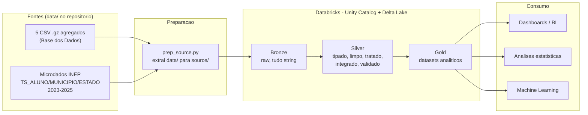
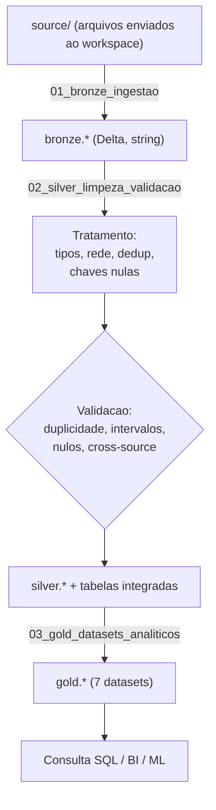
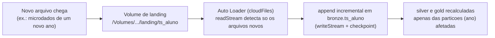

# Arquitetura da Solucao

Pipeline de analise do Indicador Crianca Alfabetizada implementada no **Databricks**
(Unity Catalog + Delta Lake), seguindo a **Arquitetura Medalhao** (bronze, silver, gold).

Indice:
1. [Visao geral](#1-visao-geral)
2. [Fluxo de dados batch](#2-fluxo-de-dados-batch)
3. [Camadas e tabelas](#3-camadas-e-tabelas)
4. [Integracao das bases](#4-integracao-das-bases)
5. [Qualidade de dados](#5-qualidade-de-dados)
6. [Ingestao streaming (Databricks)](#6-ingestao-streaming-databricks)
7. [Tecnologias e justificativas](#7-tecnologias-e-justificativas)

---

## 1. Visao geral

A ingestao e **batch** (processamento periodico) e tambem prevê **streaming** nativo do
Databricks, acionado pela chegada real de arquivos (Auto Loader ou file arrival trigger). O
streaming e detalhado na secao 6 como guia de implementacao.

---

## 2. Fluxo de dados batch

Notebooks (executados em ordem):
1. `projeto/bronze/01_bronze_ingestao.ipynb`
2. `projeto/silver/02_silver_limpeza_validacao.ipynb`
3. `projeto/gold/03_gold_datasets_analiticos.ipynb`

A preparacao dos arquivos de origem e feita por `projeto/bronze/prep_source.py`
(descompacta o `data/` e organiza em `source/` para upload no workspace).

---

## 3. Camadas e tabelas

| Camada | Papel | Tabelas |
|--------|-------|---------|
| Bronze | Copia fiel das fontes, tudo como string; so normaliza nomes de coluna. | `indicador_alfabetizacao_uf`, `indicador_alfabetizacao_municipio`, `meta_alfabetizacao_brasil`, `meta_alfabetizacao_uf`, `meta_alfabetizacao_municipio`, `ts_aluno`, `ts_municipio`, `ts_estado` |
| Silver | Tipos corrigidos, `rede` padronizada, textos limpos, duplicidades e chaves nulas tratadas, validacao e integracao. | as 8 acima (tratadas) + `indicador_municipio_integrado`, `indicador_uf_integrado`, `tratamento_silver`, `validacao_silver` |
| Gold | Datasets analiticos prontos para consumo. | `indicadores_municipio`, `metas_vs_resultados_municipio`, `metas_vs_resultados_uf`, `evolucao_temporal_municipio`, `agregacoes_uf`, `metricas_brasil`, `features_ml` |

As 8 tabelas Bronze vem de duas origens: 5 agregados curados da Base dos Dados e 3 microdados
oficiais do INEP. Os microdados `ts_*` sao a fonte canonica; os agregados servem tambem para
validacao cruzada (cross-source).

---

## 4. Integracao das bases

A integracao entre bases ocorre na **Silver**, unindo **tres fontes** na mesma granularidade:

- `indicador_municipio_integrado`: `indicador_alfabetizacao_municipio` (taxa e média, Base dos
  Dados) + `meta_alfabetizacao_municipio` (metas 2024-2030, Base dos Dados) + a distribuição por
  nível `nivel_0..8` vinda do `ts_municipio` (microdados oficiais do INEP). Deriva `codigo_uf` e
  `gap_meta_2030`.
- `indicador_uf_integrado`: análogo por UF, com os níveis vindos do `ts_estado`.

Essas tabelas alimentam diretamente a Gold, simplificando os datasets analiticos e as features de ML.

---

## 5. Qualidade de dados

Aplicada na Silver, combinando tratamento ativo e verificacao:

- **Duplicidade**: `dropDuplicates` nas chaves de negocio (registrado em `tratamento_silver`).
- **Valores ausentes**: linhas com chave de identidade nula sao removidas; nulos de metrica
  sao preservados (informativos); registros de aluno sem municipio (escolas fora do Censo
  Escolar 2025) sao mantidos, pois tem identidade valida.
- **Intervalos**: taxas e percentuais validados em [0, 100]; proficiencia em faixa plausivel.
- **Consistencia (cross-source)**: a taxa da Base dos Dados e comparada ao percentual oficial
  do INEP (`ts_*`) na mesma chave; na validacao local a diferenca media foi 0.
- Resultados ficam nas tabelas `validacao_silver` e `tratamento_silver`.

---

## 6. Ingestao streaming (Databricks)

No Databricks o streaming e nativo e reativo a chegada real de arquivos no data lake (nao ha geracao de dados sinteticos). 

**Databricks Workflows com "file arrival trigger"**
Em vez de um consumer dedicado, configura-se um **Job** com gatilho **file arrival**: quando um
arquivo novo chega ao caminho monitorado, o Databricks dispara o job automaticamente, e ele
executa os notebooks batch que ja temos (bronze -> silver -> gold). O gatilho e configurado na
UI de Jobs, sem escrever codigo.

O streaming alimenta a Bronze de forma incremental (append);
Silver e Gold sao entao recalculadas apenas para as particoes de `ano` afetadas, mantendo o
indicador atualizado sem reprocessar todo o historico.

---

## 7. Tecnologias e justificativas

| Tecnologia | Por que |
|------------|---------|
| Databricks | Ambiente gerenciado de Spark, com notebooks, catalogo e computacao sob demanda; simplifica a operacao para um projeto academico. |
| Delta Lake | Formato transacional (ACID) sobre Parquet; versionamento e desempenho para as tabelas do medalhao. |
| Unity Catalog | Organizacao das tabelas por schema (`bronze`/`silver`/`gold`) e governanca de acesso. |
| PySpark | Processamento distribuido; lida bem com os microdados de aluno (milhoes de linhas). |
| Parquet + particionamento por ano | Leitura colunar e reducao de custo de scan (boas praticas de FinOps). |
| Databricks Workflows | Orquestracao dos notebooks e gatilhos, incluindo **file arrival trigger** (dispara por chegada de arquivo, sem codigo). |

Decisoes de escopo (trade-offs) para adequar a complexidade a um trabalho de faculdade:
- **Batch** como espinha dorsal (carga historica); **streaming** nativo do Databricks, acionado
  pela **chegada real de arquivos** (file arrival trigger) - near-real-time, sem
  reprocessar o historico.
- **Lakehouse** (Delta no data lake) em vez de data warehouse dedicado: custo sob demanda e
  flexibilidade para SQL e ML.
- Integracao das bases antecipada para a **Silver**, deixando a Gold focada em analise.
